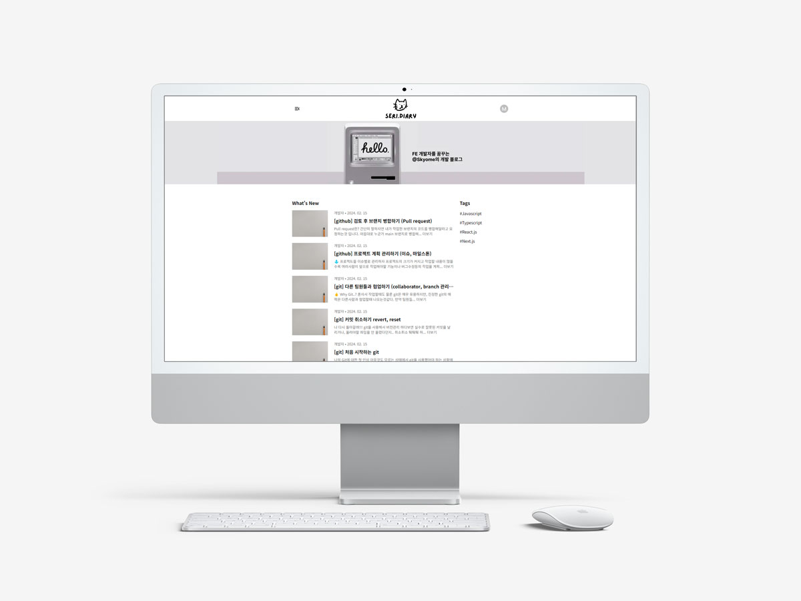
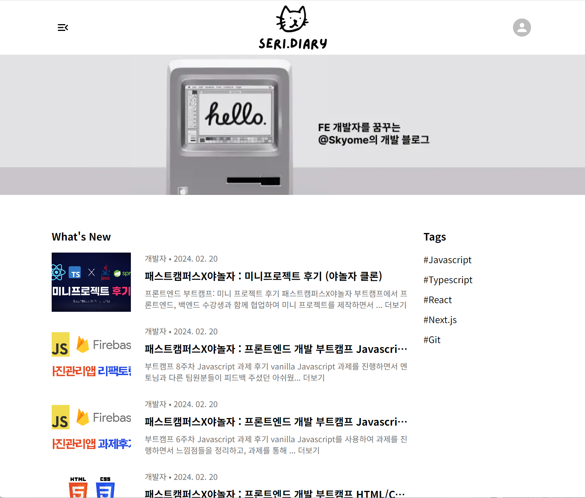
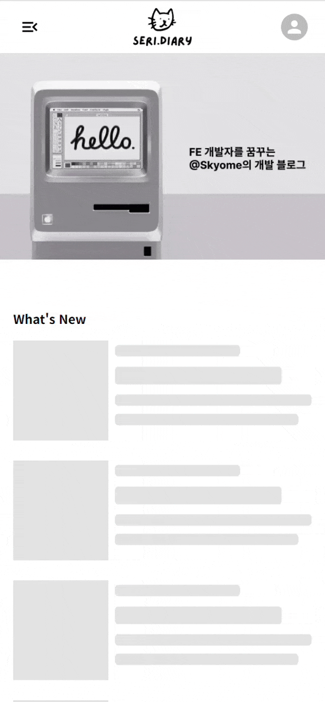
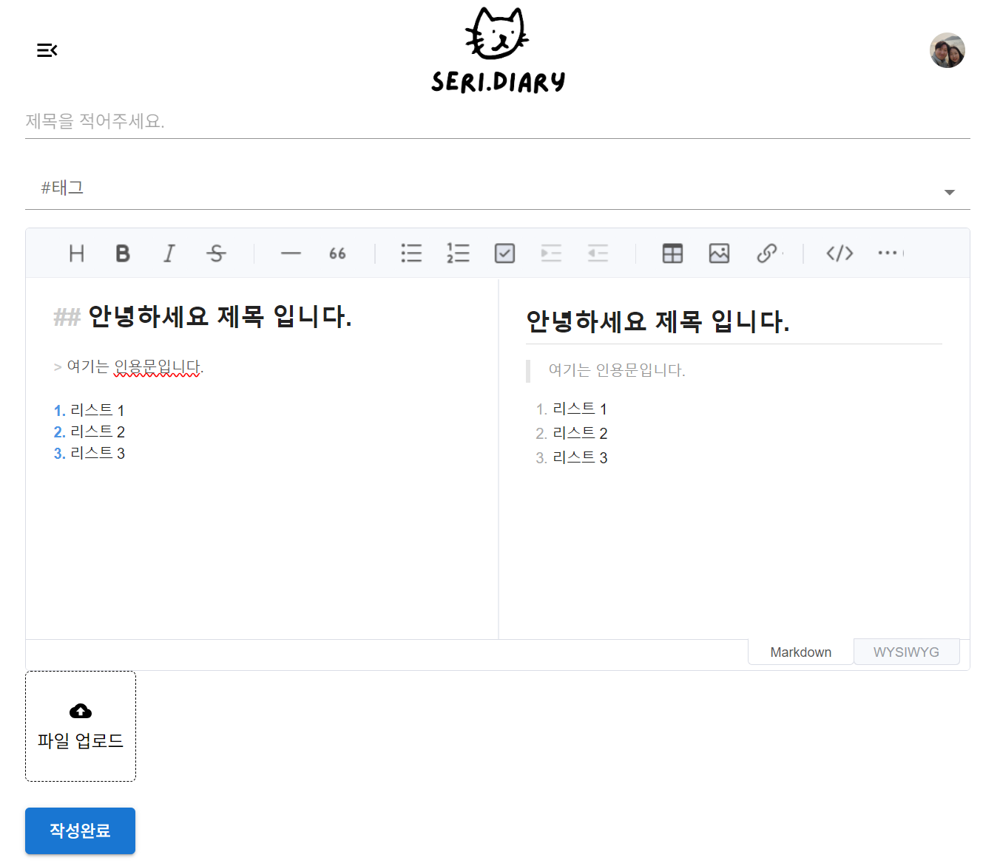

> 🏠 블로그 배포 주소 : [skk-blog](https://skkblog.com)

## 💡나만의 블로그 개발 이유

1. **학습 목적**
   velog에서 제공하는 기능도 너무 훌륭하고 좋기 때문에 필요에 의한 개발이라기 보다는 **순수하게 학습 목적**으로 작업하였다고 보면 좋을것같습니다.

1. **나만의 블로그**
   모두에게 공개된 블로그의 장점도 있겠지만 때로는 **나만의 비밀 일기장** 느낌도 좋을것같아서 제작하게 되었습니다.

1. **개발 부터 배포까지**
   요즘은 너무 편리하게 배포를 시작할 수 있는 방법이 많기에
   실제로 도메인에 접속하고, 서버에 접근하고,... 어떤 과정을 통해 진행되는지에 대해 자세히 알고 싶어져서 **직접 배포**를 해보고 싶었습니다.

<br />

---

<br />

## 🧑‍💻 사용한 개발 환경

### Next.js

React로 개발 했을때의 문제점이라고 한다면 모든 페이지에 대한 데이터를 서버로 부터 다운로드 받고 클라이언트 쪽에서 렌더링 하기 때문에 SEO에 불이익이 있고, 초기 로딩이 오래 걸릴 수 있기 때문에

1. **초기 로딩이 빠르고**
1. **SEO 최적화에 이점이 있는**

Next.js를 선택하게 되었습니다.

### firebase - db, 스토리지

직접 백엔드에 대해 공부하고 제작할 자신이 없었기에
무료로 사용할 수 있고 **러닝커브가 비교적 낮은** Firebase를 선택하였습니다.

### 미니pc - Front-end 서버

aws s3 + ec2 + 로드밸런서 등을 사용하여
https 인증서 + 스토리지 서버 + 프론트 서버 를 제작하여 사용중에
문득 직접 서버를 사용해보고 싶다는 생각이 들어 알리 핫딜이 떴을때 구입하여 **직접 서버를 구축**하였습니다.
블로그 서버 구축기는 이후에 포스팅해보겠습니다.

<br />

---

<br />

## 🔨 주요 화면

> 🏠 메인 페이지 : /  
> 📒 블로그 목록페이지 : /free  
> ✍️ 블로그 상세페이지 : /free/:id  
> 🧑 마이페이지 : /mypage  
> 로그인/회원가입 : /auth/signin , /auth/signup

**pc에서 본 메인페이지**  


**모바일에서 본 메인페이지**  


<br />

<br />

<details>
<summary>주요 작업 내용</summary>

### 초기 설정 (간단 설명)

**next.js 설치**

skk-blog라는 부분은 폴더명이니까 원하시는대로 변경하시면 됩니다.
`yarn create next-app skk-blog --typescript`

**기초설정 - next.config.js**

```javascript
/** @type {import('next').NextConfig} */
const nextConfig = {
  reactStrictMode: true,
  trailingSlash: true,
  // 이미지최적화를 위해서 저장되어있는 스토리지 주소를 적어줍니다.
  images: {
    domains: ["firebasestorage.googleapis.com", "localhost"],
    loader: "akamai",
    path: "",
  },
  generateBuildId: () => "skkblog-deploy-project",
  // 아래 주소들만 out폴더에 만들어준다. => getServerSideProps있는 페이지는 제외
  exportPathMap: () => ({
    "/": { page: "/" },
    "/auth/find-password": { page: "/auth/find-password" },
    "/auth/signin": { page: "/auth/signin" },
    "/auth/signup": { page: "/auth/signup" },
    "/free": { page: "/free" },
    "/free/new": { page: "/free/new" },
    "/404": { page: "/404" },
  }),
};

module.exports = nextConfig;
```

**mui 설치**
`yarn add @emotion/react @emotion/styled @mui/icons-material @mui/material`

더 자세한 설정파일은 [github](https://github.com/skyeome/skk-blog)에서 확인 해주세요!

---

### 로그인 / 회원가입 페이지

이메일(아이디) 비밀번호 양식을 validation 하기 위해서
`react-hook-form`과 `yup`을 사용하였습니다.

**설치 방법**
`yarn add react-hook-form yup @hookform/resolvers`

**yup 설정 하기**
yup을 사용하여 validation할 `name`과 어떤 검사를 할지 정리해줍니다.
yup.object({}) 안에 yup.string(), yup.required() 등의 조건을 넣어주면 간단히 유효성 검사를 할 수 있습니다.
아래 예시를 보시면 좀 더 이해하기 쉬울 수 있습니다.

```typescript
// src/common/libraries/yup.ts

// 이메일 중복 확인 함수
const chkEmail = async (
  value: string,
  values: yup.TestContext<any>
): Promise<boolean> => {
  try {
    const sn = await getDocs(
      query(collection(db, "User"), where("email", "==", value)) // 유저 콜렉션에 email이 같은 유저가 있는지 확인 합니다.
    );
    const data = sn.docs;
    if (data.length === 0) {
      return true; // 같은 유저가 없으면 true를 반환
    } else {
      return false; // 같은 유저가 있으면 false를 반환
    }
  } catch (e) {
    values.createError({ path: "purchase_code" });
    return false;
  }
};

// 회원가입 예시
export const signUpSchema = yup.object({
  userId: yup
    .string()
    .required("이메일 주소(ID)를 입력해 주세요")
    .email("이메일 형식으로 입력해주세요")
    .test(
      // 이메일 중복을 확인합니다.
      "isInUseEmail",
      "이미 사용중인 이메일 입니다.",
      async (value, values) => {
        return await chkEmail(value, values);
      }
    ),
  nickname: yup.string().required("닉네임을 입력해 주세요"),
  password: yup
    .string()
    .required("비밀번호를 입력해 주세요")
    .matches(/^(?=.*[a-zA-Z])(?=.*[!@#$%^*+=-])(?=.*[0-9]).{8,15}$/, {
      message: "영문 숫자 특수기호 조합 8자리 이상으로 입력해주세요",
    })
    .max(15, "비밀번호는 15자리 이하여야 합니다.")
    .min(8, "비밀번호는 8자리 이상이어야 합니다."),
  password2: yup
    .string()
    .matches(/^(?=.*[a-zA-Z])(?=.*[!@#$%^*+=-])(?=.*[0-9]).{8,15}$/, {
      message: "영문 숫자 특수기호 조합 8자리 이상으로 입력해주세요",
    })
    .max(15, "비밀번호는 15자리 이하여야 합니다.")
    .min(8, "비밀번호는 8자리 이상이어야 합니다.")
    // 비밀번호가 비밀번호 확인과 일치하는지 확인
    .oneOf([yup.ref("password"), undefined], "비밀번호가 일치하지 않습니다."),
  term: yup.boolean().required("이용약관에 동의해주세요").oneOf([true]),
  term2: yup
    .boolean()
    .required("개인정보 수집 및 이용에 동의해주세요")
    .oneOf([true]),
});
```

**로그인/회원가입 ui**
react-hook-form은 uncontrolled 방식이기 때문에 mui와 같이 사용하려면 `<Controller />`로 감싸주어야 합니다.

`name`에 react-hook-form으로 등록할 name을 적어주고
`control` 에는 useForm에서 반환한 control 객체를 넣어줍니다.
`render`에는 실제 mui의 `<TextField />`를 사용하여 ui를 제작하면 됩니다.

```tsx
<Controller
  name="userId"
  control={control}
  render={({ field }) => (
    <TextField
      {...field}
      placeholder="수신 가능한 이메일 주소(ID)를 입력해 주세요"
      sx={{ mb: 1 }}
      fullWidth
    />
  )}
/>
```

---

<br />

### 글 작성 : toast-ui editor



**마크다운 작성 : toast-ui editor**

notion에서도 쓰이고, 이글을 쓰는 velog도 쓰는 문법인 마크다운 문법이기 때문에 범용성이 좋고 사용법이 쉬워 서로 글 내용을 복사 붙여넣기 하면서 공유하기도 편리한것같아서 사용하게 되었습니다.

유명한 마크다운 에디터중 하나인 toast-ui editor를 사용하여 개발 하였습니다.

`yarn add @toast-ui/react-editor`로 설치할 수 있습니다.

**toast-ui editor ssr 문제 해결**
toast-ui editor는 SSR을 지원하지 않기 때문에 그냥 import를 해서 사용하면 "self is not defined... " 라는 문구가 뜨면서 제대로 로딩이 되지 않습니다.

그 이유는 서버에서 렌더링을 하는 방식에서는 프리 렌더링이라는 과정이 필요한데 이 과정에서는 서버측에서 렌더링하는것이기 때문에
클라이언트에서 사용 가능한 `self`를 사용할 수 없기 때문에 이러한 문제가 생긴다고 알고 있습니다.

`dynamic import`를 사용하여 이 문제를 해결 해주어야 사용 가능합니다.

```typescript
// src/components/units/board/write/BoardWrite.index.tsx
import dynamic from "next/dynamic";

// ...기타 생략
const TuiEditor = dynamic(
  async () => await import("../../../commons/editor/TuiEditor"),
  { ssr: false }
);

function BoardWrite({ isEdit, data }: BoardWriteProps) {
  // useForm 등의 로직들...
  return (
    // 제목, 태그 ui...
    <TuiEditor
      showToast={showToast} // mui toast를 부르는 함수전달(toast editor와는 무관)
      initialValue={data?.contents}
      editorRef={editorRef}
    />
    // 섬네일 업로드 ui...
  );
}
export default BoardWrite;
```

**에디터로 이미지 업로드**

toast-ui 에디터에서 이미지를 업로드 하면 기본 설정은 base64 형태로 문서에 저장하는 방식입니다.

즉 이미지가 많아질수록 내용이 보여지기까지 오래걸릴 수 있어, 로딩속도에 지장을 줄 수 있다는 판단이 들어서
라이브러리가 제공하는 `addImageBlobHook`을 사용해서 이미지는 따로 업로드 하는 방식으로 개발 였습니다.

```tsx
// ...import 부분
export default function TuiEditor({
  showToast,
  initialValue,
  editorRef,
}: EditorProps): JSX.Element {
  const onUploadImage = async (
    blob: Blob | File,
    callback: (url: string, text?: string) => void
  ): Promise<void> => {
    if (blob instanceof File) {
      const isValid = checkImageValidation(showToast, blob);
      if (!isValid) return;
      try {
        const storageRef = ref(storage, `images/${blob?.name ?? "file"}`);
        const uploadRef = await uploadBytes(storageRef, blob);
        const url = await getDownloadURL(uploadRef.ref);
        callback(url, blob?.name);
      } catch (error) {
        if (error instanceof Error) showToast("error", error.message);
      }
    }
  };
  return (
    <Editor
      previewStyle="vertical"
      height="400px"
      initialEditType="markdown"
      initialValue={initialValue ?? ""}
      ref={editorRef}
      hooks={{ addImageBlobHook: onUploadImage }}
    />
  );
}
```

**addImageBlobHook 작동 원리**
에디터에 이미지가 업로드 되면 `addImageBlobHook`이 blob과 callback을 제가 만든 `onUploadImage`함수에 전달해줍니다.

`onUploadImage`에서는

1. **checkImageValidation**함수를 만들어서 이미지가 용량이 너무 크지는 않은지, 이미지 형식에 **어긋나지는 않는지 여부를 확인** 합니다.
1. 유효성 검사에 **통과못하면 early return**해서 중단하고,
1. 통과하였다면, try-catch로 **이미지를 업로드하고** 에러를 catch 합니다.
1. 최종적으로 업로드된 이미지의 url과 alt text를 **callback을 실행**하여 전달하면 이미지가 반영됩니다.

<br />

### 글 조회 : viewer, getServerSideProps

toast-ui editor로 작성한 글을 보려면 `<Viewer />` 컴포넌트를 사용하면 간단하게 볼 수 있습니다.

**뷰어로 글 내용 보여주기**
뷰어 가져오기 (dynamic import 필요)

```typescript
const Viewer = dynamic(
  async () => await import("@toast-ui/react-editor").then((mod) => mod.Viewer),
  { ssr: false }
);
```

뷰어 사용하려면 `initialValue` props에 데이터를 전달하면 됩니다.

```
<Viewer initialValue={data.contents} />
```

**getServerSideProps로 아이디 값 가져오기**
useRouter를 사용하여 /free/:id 형식의 값을 가져오게 되면 초기에 받아온 id의 값이 undefined가 되는 문제가 있었습니다.

이렇게 되면 데이터를 받아올때 id를 기준으로 받아오기 때문에 데이터를 정상적으로 받지 못하는 문제가 있기 때문에
`getServerSideProps`로 **id값을 미리 렌더링전 가져오게** 개발하였습니다.

```tsx
import type { InferGetServerSidePropsType, GetServerSideProps } from "next";
// ...기타 import 생략

export default function BoardDetailPage({
  id,
}: InferGetServerSidePropsType<typeof getServerSideProps>): JSX.Element {
  const router = useRouter();
  const result = useQueries([
    {
      queryKey: ["board", id],
      queryFn: async () => await getBoardDetail(id),
    },
    {
      queryKey: ["board", id, "comments"],
      queryFn: async () => await getCommentData(id),
    },
  ]);

  // 게시글을 찾지 못하였을때 다른 페이지로 이동
  useEffect(() => {
    if (result[0].isFetched && result[0].data === undefined)
      void router.replace("/free/not-found");
  }, [result[0].data, result[0].isFetched]);

  return (
    <>
      {result[0].data !== undefined && <BoardDetail data={result[0].data} />}
      <CommentWrite refetch={result[1].refetch} />
      <CommentList comments={result[1].data} />
    </>
  );
}

export const getServerSideProps: GetServerSideProps<{ id: string }> = async (
  context
) => {
  // context에서 query 추출
  const { query } = context;
  // query에서 boardId를 추출
  const { boardId } = query;
  let id = "";

  if (boardId === undefined) id = "";
  if (typeof boardId === "string") id = boardId;
  if (typeof boardId === "object") id = boardId[0];

  return {
    props: {
      id,
    },
  };
};
```

</details>
